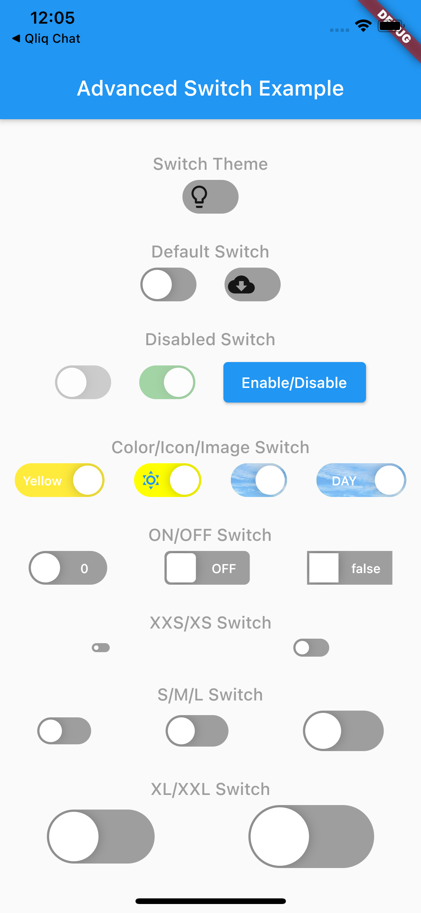
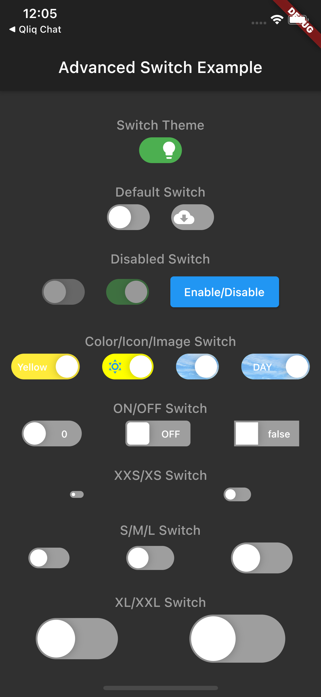
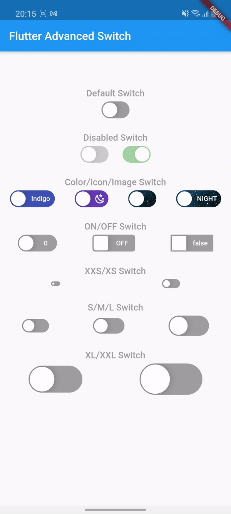

# flutter_advanced_switch
An advanced switch widget, that can be fully customized with size, text, color, radius of corners.


| Switch Light | Switch Dark |
|:-:|:-:|
|  |  |

## Getting Started
In the `pubspec.yaml` of your flutter project, add the following dependency:

```yaml
dependencies:
    ...
    flutter_advanced_switch: <latest_version>
```

Import in your project:

```dart
import 'package:flutter_advanced_switch/flutter_advanced_switch.dart';
```

## Examples

### How to use

```dart
// ...
// 1. Create a controller in the state of the StatefulWidget
final _controller = ValueNotifier<bool>(false);

// 2. In case, you want to call setState on switch changes.
// 2.1. Add event listener, for example in the initState() method.
// ...
bool _checked = false;

// ...
@override
void initState() {
  super.initState();

  _controller.addListener(() {
    setState(() {
      if (_controller00.value) {
        _checked = true;
      } else {
        _checked = false;
      }
    });
  });
}

// 3. Add AdvancedSwitch to the build method.
// ...
AdvancedSwitch(
    controller: _controller,
),
// ...
```

Regular Switch

```dart
// ...
final _controller = ValueNotifier<bool>(false);
// ...
AdvancedSwitch(
    controller: _controller,
)
// ...
```

Customized Switch

```dart
// ...
final _controller = ValueNotifier<bool>(false);
// ...
AdvancedSwitch(
    controller: _controller,
    activeColor: Colors.green,
    inactiveColor: Colors.grey,
    activeChild: Text('ON'),
    inactiveChild: Text('OFF'), 
    activeImage: AssetImage('assets/images/on.png'),
    inactiveImage: AssetImage('assets/images/off.png'),
    borderRadius: BorderRadius.all(const Radius.circular(15)),
    width: 50.0,
    height: 30.0,
    enabled: true,
    disabledOpacity: 0.5,
),
// ...
```

Custom thumb

```dart
// ...
final _controller = ValueNotifier<bool>(false);
// ...
AdvancedSwitch(
    controller: _controller,
    thumb: ValueListenableBuilder(
        valueListenable: _controller,
        builder: (_, value, __) {
            return Icon(value
                ? Icons.lightbulb
                : Icons.lightbulb_outline);
        },
    ),
),
// ...
```

## AdvancedSwitch Parameters
|Parameter| Description                                         | Type                  | Default             |
|:--------|:----------------------------------------------------|:----------------------|:--------------------|
|`controller`| Determines current state.                    | *ValueNotifier<bool>* ||
|`activeColor`| Determines background color for the active state.                           | *Color*               | Colors.green        |
|`inactiveColor`| Determines background color for the inactive state.   | *Color*               | Colors.grey         |
|`activeChild`| Determines label for the active state. | *Widget*              ||
|`inactiveChild`| Determines label for the inactive state.              | *Widget*              ||
|`activeImage`| Determines background image for the active state.            | *ImageProvider*       ||
|`inactiveImage`| Determines background image for the inactive state.   | *ImageProvider*       ||
|`borderRadius`| Determines border radius. | *BorderRadius*        | Radius.circular(15) |
|`width`| Determines width.                           | *Double*              | 50.0                |
|`height`| Determines height.                                   | *Double*              | 30.0                |
|`enabled`| Determines if widget is enabled.                                  | *bool*                | true                |
|`disabledOpacity`| Determines opacity of disabled control.             | *double*              | 0.5                 |
| `thumb`         | Custom thumb widget                                 | *Widget*              ||
| `initialValue`  | Initial value                                       | *bool*                | false               |
| `onChanged`         | Changed callback                                    | *ValueChanged<bool>*  ||

# Demo

