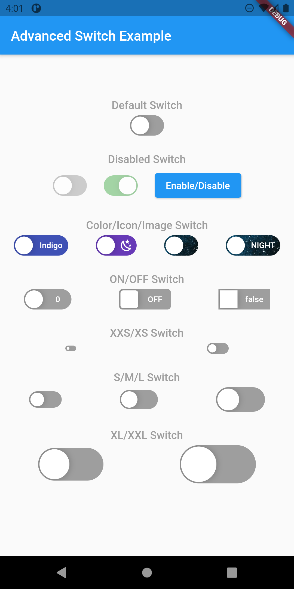
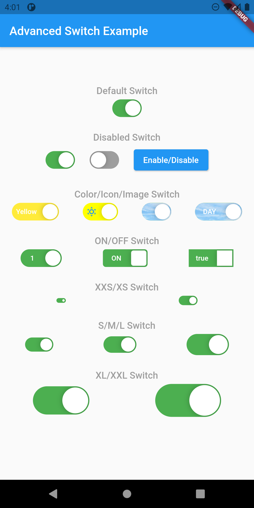
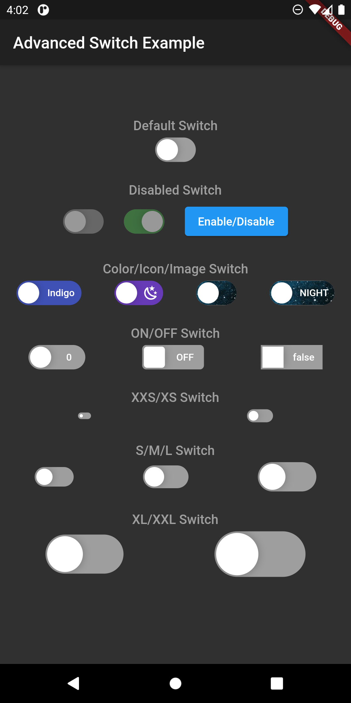
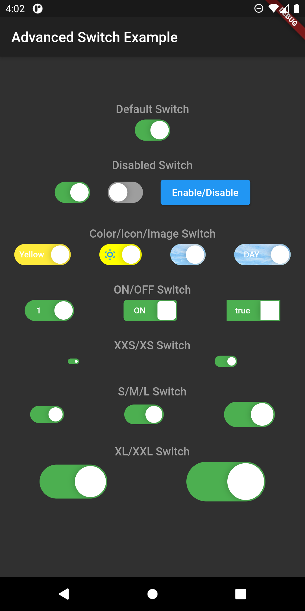

# flutter_advanced_switch
An advanced swicth widget, that can be fully customized with size, text, color, radius of corners.

| Switch OFF State | Switch ON State |
|:-:|:-:|
|  |  |
|  |  |

## Getting Started
In the `pubspec.yaml` of your flutter project, add the following dependency:

```yaml
dependencies:
    ...
    flutter_advanced_switch: <latest_version>
```

Import in your project:

```dart
import 'package:flutter_advanced_switch/flutter_advanced_switch.dart';
```

## Examples

Regular Switch

```dart
final _controller = AdvancedSwitchController();
// ...
AdvancedSwitch(
    controller: _controller,
)
// ...
```

Customized Switch

```dart
final _controller = AdvancedSwitchController();
// ...
AdvancedSwitch(
    controller: _controller,
    activeColor: Colors.green,
    inactiveColor: Colors.grey,
    activeChild: Text('ON'),
    inactiveChild: Text('OFF'), 
    activeImage: AssetImage('assets/images/on.png'),
    inactiveImage: AssetImage('assets/images/off.png'),
    borderRadius: BorderRadius.all(const Radius.circular(15)),
    width: 50.0,
    height: 30.0,
    enabled: true,
),
// ...
```

## AdvancedSwitch Parameters
|Parameter|Description|Type|Default|
|:--------|:----------|:---|:------|
|`controller`| |*AdvancedSwitchController*||
|`activeColor`| |*Color*|Colors.green|
|`inactiveColor`| |*Color*|Colors.grey|
|`activeChild`| |*Widget*||
|`inactiveChild`| |*Widget*||
|`activeImage`| |*ImageProvider*||
|`inactiveImage`| |*ImageProvider*||
|`borderRadius`| |*BorderRadius*|Radius.circular(15)|
|`width`| |*Double*|50.0|
|`height`| |*Double*|30.0|
|`enabled`| |*bool*|true|

# Demo


