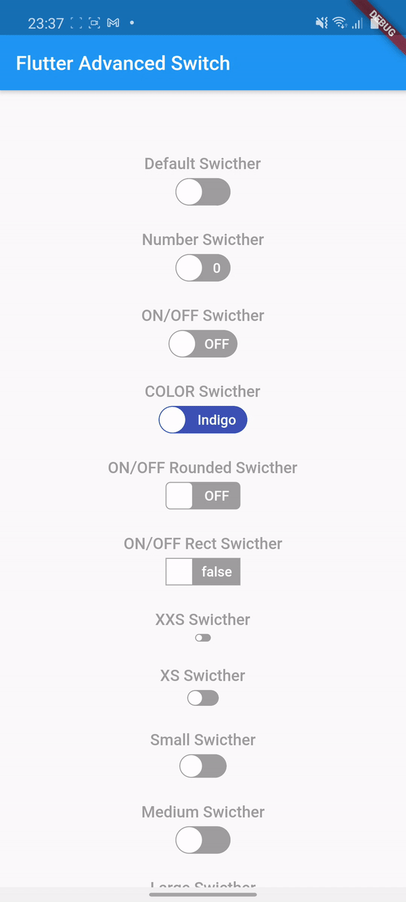

# flutter_switcher
An advanced swicth widget, that can be fully customized with size, text, color, radius of corners.


## Gettings Started
In the `pubspec.yaml` of your flutter project, add the following dependency:

```yaml
dependencies:
    ...
    flutter_advanced_switch: <latest_version>
```

Import in your project:

```dart
import 'package:flutter_advanced_switch/flutter_advanced_switch.dart';
```

## Basic Example

Default switch

```dart
// ...
AdvancedSwitch(
    value: _value, // Boolean
    onChanged: (value) => setState(() { // Callback (or null to disable)
        _value = value;
    }),
)
// ...
```

Customized switch

```dart
// ...
AdvancedSwitch(
    value: _value, // Boolean
    activeColor: Colors.green, // Color
    inactiveColor: Colors.grey, // Color
    activeLabel: 'ON', // String
    inactiveLabel: 'OFF',  // String
    activeTextStyle: theme.textTheme.bodyText1, // TextStyle
    inactiveTextStyle: theme.textTheme.bodyText1, // TextStyle
    activeImage: theme.textTheme.bodyText1, // ImageProvider
    inactiveImage: theme.textTheme.bodyText1, // ImageProvider
    borderRadius: BorderRadius.all(const Radius.circular(15)), // BorderRadius
    width: 50.0, // Double
    height: 30.0, // Double
    onChanged: (value) => setState(() { // Callback (or null to disable)
        _value = value;
    }),
),
// ...
```

## DEMO

