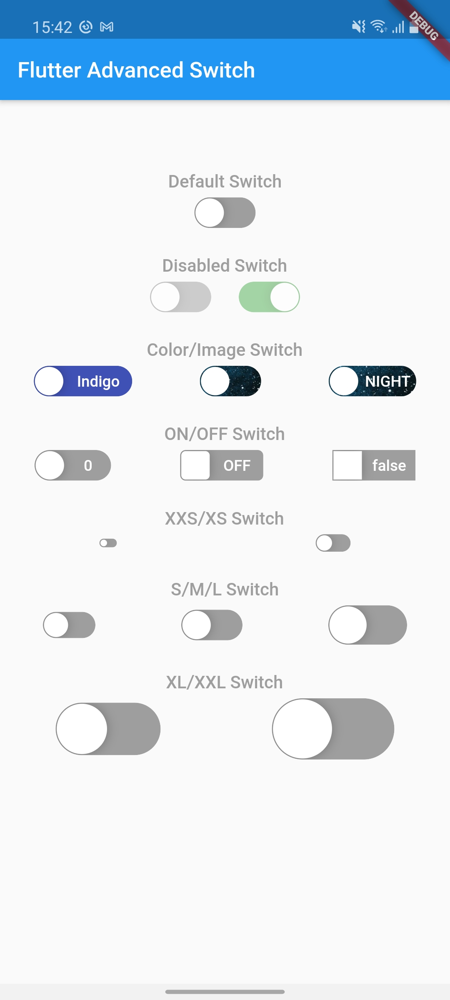
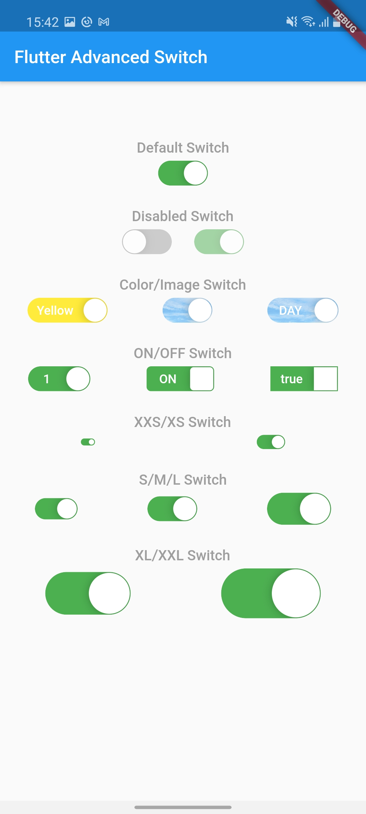

# flutter_advanced_switch
An advanced swicth widget, that can be fully customized with size, text, color, radius of corners.

| Switch OFF State | Switch ON State |
|:-:|:-:|
|  |  |

## Getting Started
In the `pubspec.yaml` of your flutter project, add the following dependency:

```yaml
dependencies:
    ...
    flutter_advanced_switch: <latest_version>
```

Import in your project:

```dart
import 'package:flutter_advanced_switch/flutter_advanced_switch.dart';
```

## Examples

Regular Switch

```dart
final _controller = AdvancedSwitchController();
// ...
AdvancedSwitch(
    controller: _controller, // AdvancedSwitchController
)
// ...
```

Customized Switch

```dart
final _controller = AdvancedSwitchController();
// ...
AdvancedSwitch(
    controller: _controller, // AdvancedSwitchController
    activeColor: Colors.green, // Color
    inactiveColor: Colors.grey, // Color
    activeChild: Text('ON'), // Widget
    inactiveChild: Text('OFF'),  // Widget
    activeImage: AssetImage('assets/images/on.png'), // ImageProvider
    inactiveImage: AssetImage('assets/images/off.png'), // ImageProvider
    borderRadius: BorderRadius.all(const Radius.circular(15)), // BorderRadius
    width: 50.0, // Double
    height: 30.0, // Double
),
// ...
```

# Demo


